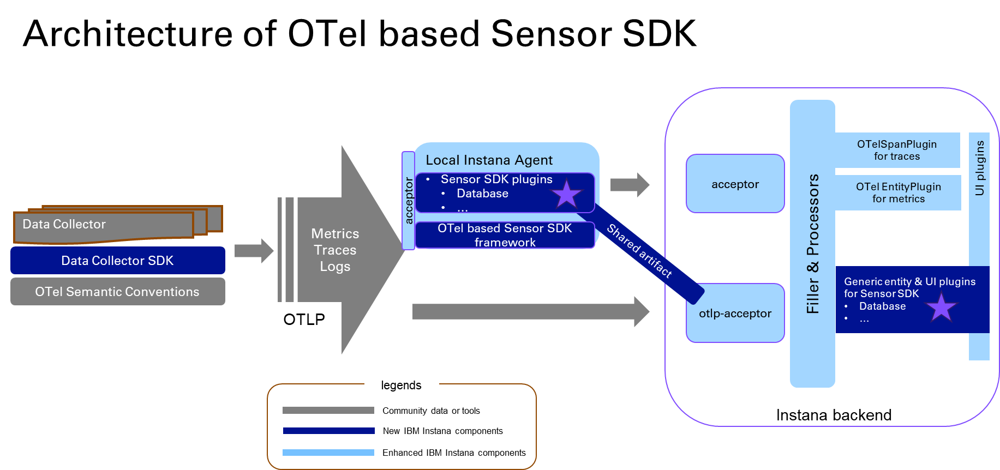

# OTel Event DC

This DC allows users to post a JSON format event to its endpoint. It will send the event to the generic OTel Event Sensor via the OTel protocol.

## Architecture



The implementation is split into two stages:
1. Before the logs channel is ready, this DC sends events via the metrics channel.
1. After the logs channel is ready, this DC will send events via the logs channel.

## Configuration

The configuration of an OTel Event DC is as follows:

```yaml
# OTel Event DC properties:
instances:
  - otel.backend.url: http://9.112.252.66:4318/v1/metrics
    otel.backend.using.http: true
```

## RESTful APIs

Users can post a JSON event to the following URL:

```
curl -X POST -H "Content-Type: application/json" http://localhost:8008/events -d@test.json
```

The JSON payload should contain the necessary information for the sensor and the backend to process the event. The DC will validate the required fields.

Users can refer to [the official document](https://opentelemetry.io/docs/specs/otel/logs/data-model/#log-and-event-record-definition) for details.

Below is a sample of an event JSON:
```json
{    
  "timestamp": 1709190814.136849342,            # required, a float value or a string like '2024-03-03T10:15:30.00Z'
  "observedTimestamp": 1709190814.136849342,    # required, a float value or a string like '2024-03-03T10:15:30.00Z'
  "traceId": null,                              # optional,
  "spanId": null,                               # optional,
  "traceFlags": 0,                              # optional,
  "severityText": "ERROR",                      # required, a string for severity, need to convert for different backend
  "severityNumber": 20,                         # required, an integer for severity, need to convert for different backend
  "body": "This is an error example.",          # optional, a string or an object to describe the event
  "resource": {                                 # required, an object, indicate the related resource where the event occurred
    "plugin": "ApmDatabase",                    # backend dependent fields, required by Instana
    "dataCenter": "rtp",    
    "name": "dt21.fyre.ibm.com"    
  },    
  "instrumentationScope": "web-event@0.1",      # required, a string of name and version
  "attributes": {                               # required, an object for event attributes
    "duration": 600,    
    "previous": {    
      "metric1": 1.03    
    },    
    "metric1": 0.02,    
    "description": "The value of metric1 should be greater than 1."    
  },    
  "id": "rtp:dt21.fyre.ibm.com:sample-error"    # required, the string type ID of the event instance
}
```

## Build and Run the DC

### Build

```
gradle clean test
```

Note: users can refer to [gradle](https://gradle.org/) to install the gradle utility.

### Run

```
gradle bootRun
```

### Configuration

Users can change file `src/main/resources/application.properties` before running the DC to change the configuration.

```
server.port=8008
poll.interval=10
callback.interval=10
otel.backend.url=http://9.46.248.142:4318/v1/metrics
otel.backend.using.http=true
```

### DC Logging

Users can modify the same file `src/main/resources/application.properties` to set logging levels for the DC. The settings can be specified to packages. The available levels are: `ERROR`, `WARN`, `INFO`, `DEBUG`, and `TRACE`.

For example:

```
logging.level.root=ERROR
logging.level.com.instana.dc.controllers=INFO 
```

## Reference

[OTel documentation](https://opentelemetry.io/docs/)
